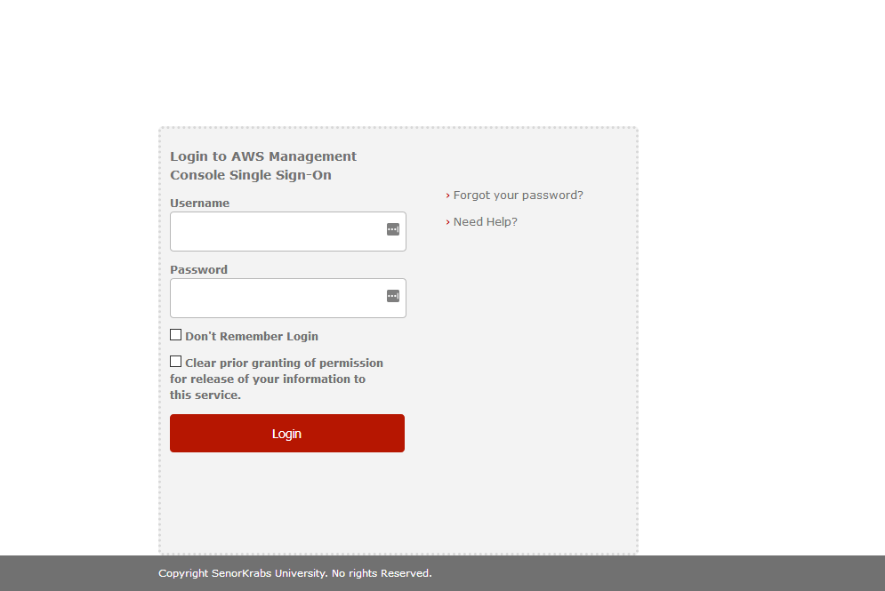
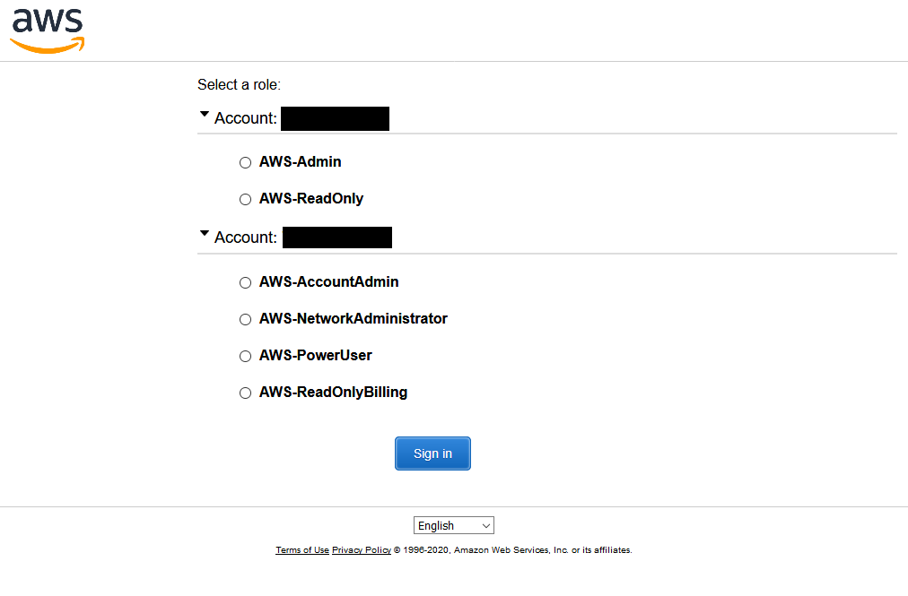
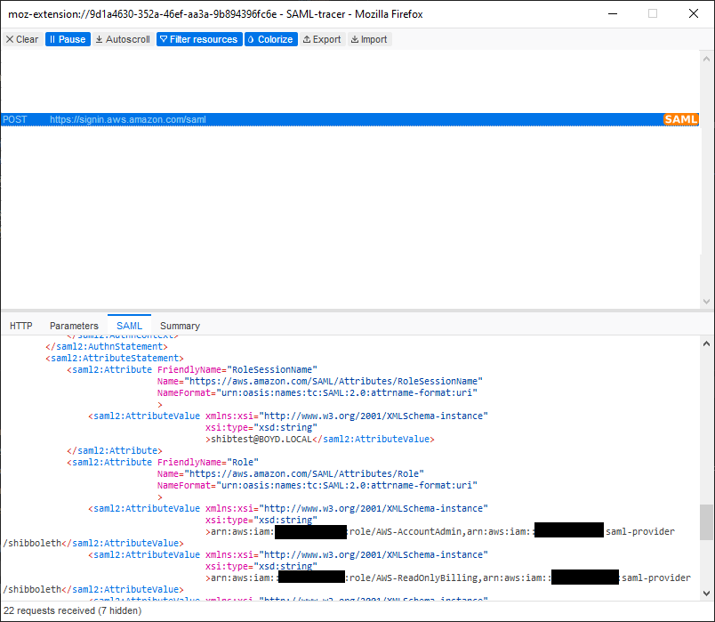

# AWS SAML Identity Provider Setup

- [AWS SAML Identity Provider Setup](#aws-saml-identity-provider-setup)
  - [Overview](#overview)
  - [Prerequisites](#prerequisites)
  - [Setup](#setup)
    - [Step 1: Update metadata-providers.xml](#step-1-update-metadata-providersxml)
    - [Step 2: Update attribute-resolvers.xml](#step-2-update-attribute-resolversxml)
    - [Step 3: Update attribute-filter.xml](#step-3-update-attribute-filterxml)
    - [Step 4: Update saml-nameid.xml](#step-4-update-saml-nameidxml)
    - [Step 5: Update relying-party.xml](#step-5-update-relying-partyxml)
    - [Step 6: Deploy](#step-6-deploy)
    - [Step 7: Test](#step-7-test)
  - [Troubleshooting](#troubleshooting)
    - [AWS Sign-in Page Error and the SAML Response returns no roles](#aws-sign-in-page-error-and-the-saml-response-returns-no-roles)
    - [Error: Not authorized to perform sts:AssumeRoleWithSAML](#error-not-authorized-to-perform-stsassumerolewithsaml)
  - [Additional Resources](#additional-resources)


## Overview
In order to authenticate to AWS using Shibboleth, the IdP must be configured to pass assertions to the AWS SAML endpoint with the `Role` list, `RoleSessionName` and (optionally) the `SessionDuration`. 

The instructions below will setup the following:

1. The AWS SP with the EntityId `urn:amazon:webservices`
2. An attribute resolver that returns Roles based on LDAP groups the user belongs to, which begin with `AWS-[account-id]-[groupname]`. These translated roles are `arn:aws:iam::[account-id]:role/AWS-[groupname]`. 
3. An attribute filter that releases the appropropriate attributes: `Role`, `RoleSessionName`, and `userPrincipalName` (for `NameID`).
4. A `NameID` and `RelyingParty` configuration that will return the `userPrincipalName` 

| :information_source: &nbsp;&nbsp; Important| 
|:-|
| Configuring `userPrincipalName` and `NameID` are optional for authenticating to the AWS console, but it is recommended they be configured to support other scenarios, such as SAML federation for Appstream. The instructions below pre-configure several *custom* entities that may be used in other scenarios| 

## Prerequisites
- **Shibboleth 3.x+ Server**: You must have a Shibboleth server setup already. 
- **LDAP-based backend**: This guide assumes that you are using an LDAP backend for password authentication and attribute resolution. Other backends can certainly work, but this guide is based on an Active Directory backend.
- **IAM SAML Identity Provider**: You must have a [SAML Identity Provider](https://docs.aws.amazon.com/IAM/latest/UserGuide/id_roles_providers_create_saml.html) configured in all of your accounts, with a consistent name. You can use [saml-idp-cfn.yml](../templates/saml-idp-cfn.yml) to deploy this. 
- **IAM Roles for Federation**: The roles that users will assume during federation must be defined in each AWS account and have a [policy attached that allows federation from your SAML Identity Provider](https://docs.aws.amazon.com/IAM/latest/UserGuide/id_roles_providers_enable-console-saml.html). You can use [saml-sample-roles.yml](../templates/saml-sample-roles.yml) to deploy these. 
- **LDAP Groups**: You must have LDAP groups (or Security Groups in Active Directory) for each account and role that you want to allow users to assume, and have added the appropriate users to that group. The naming convention for the LDAP Groups should be: `AWS-[account-id]-[group-name]`. Example: `AWS-123456789012-PowerUser`. This will be translated to the role `arn:aws:iam::123456789012:role/AWS-PowerUser` which must exist in the AWS account.
    
## Setup

| :information_source: &nbsp;&nbsp; Important| 
|:-|
| The instructions below are based on a Shibboleth IdP that is using an `AdAuthenticator` and AD-backed LDAP. You may need to specify different attributes in your resolver configuration, depending on your setup. | 

### Step 1: Update metadata-providers.xml
1. Open `/opt/shibboleth-idp/conf/metadata-providers.xml`

2. Add a metadata provider element, making sure the `backingFile` attribute references the path to `aws-appstream.xml` from step 1:

    ```xml
    <MetadataProvider id="AWS"  
        xsi:type="FileBackedHTTPMetadataProvider" 
        backingFile="%{idp.home}/metadata/sp/aws.xml"
        metadataURL="https://signin.aws.amazon.com/static/saml-metadata.xml"
    />
    ```

### Step 2: Update attribute-resolvers.xml
Shibboleth can resolve and insert Attributes into the SAML assertion (response) sent back to the user after authenticating. The AWS SP expects two attributes to be returned:
- **Role**

  Example: `arn:aws:iam::<account-id>:role/RoleName,arn:aws:iam::<account-id>:saml-provider/<provider-name>`
- **RoleSessionName**

  Example: `username` or `username@domain.com`

Multiple Roles can be included in the SAML Response to indicate that the principal is authorized to assume various roles in various AWS accounts. 

To query these attributes, we must configure an attribute resolver. To return these attributes, we must configure an attribute filter.

| :information_source: &nbsp;&nbsp; Important| 
|:-|
| Although only `Role `and `RoleSessionName` are the only attributes that the AWS SP requires to be returned, the resolver configuration below includes additional attribute definitions that are useful for other services, including AppStream, LakeFormation, Redshift, and AWS SSO. | 

1. Open `/opt/shibboleth-idp/conf/attribute-resolvers.xml`. Within the `<AttributeResolver>` element add the following definitions:
    | :information_source: &nbsp;&nbsp; Important| 
    |:-|
    | The value in `Role` below assumes the SAML Provider in your AWS account is named `arn:aws:iam::[account-id]:saml-provider/shibboleth`. If it's named something else, change it to the correct name, remembering to leave `$1` variable for the account id placeholder| 

    ```xml
    <!-- 
        AWS Attribute Definitions 
    -->
    <AttributeDefinition id="awsRoles" xsi:type="Mapped">
        <InputDataConnector ref="myLDAP" attributeNames="memberOf"/>
        <AttributeEncoder xsi:type="SAML2String" name="https://aws.amazon.com/SAML/Attributes/Role" friendlyName="Role" />
            <ValueMap>
                <ReturnValue>arn:aws:iam::$1:role/AWS-$2,arn:aws:iam::$1:saml-provider/shibboleth</ReturnValue>
            <SourceValue>CN=AWS-(\d{12})-(\w*),.*</SourceValue>
            </ValueMap>     
    </AttributeDefinition>
    
    <AttributeDefinition id="awsRoleSessionName" xsi:type="Simple">
        <InputDataConnector ref="myLDAP" attributeNames="userPrincipalName"/>
        <AttributeEncoder xsi:type="SAML2String" name="https://aws.amazon.com/SAML/Attributes/RoleSessionName" friendlyName="RoleSessionName" />
    </AttributeDefinition>
      
    <!-- 
        LakeFormation Attribute Definitions
        https://docs.aws.amazon.com/emr/latest/ManagementGuide/emr-lf-federation.html 
    -->
    
    <!-- Matches any LDAP groups where CN=LakeFormation-[group-name] -->
    <AttributeDefinition id="lakeFormationGroups" xsi:type="Mapped">
        <InputDataConnector ref="myLDAP" attributeNames="memberOf"/>
        <AttributeEncoder xsi:type="SAML2String" name="https://lakeformation.amazon.com/SAML/Attributes/Groups" friendlyName="Groups" />
            <ValueMap>
                <ReturnValue>$1</ReturnValue>
            <SourceValue>CN=LakeFormation-(\w*),.*</SourceValue>
            </ValueMap>
    </AttributeDefinition>

    <!-- Returns userPrincipalName as the Username attribute for federated Lake Formation permissions -->
    <AttributeDefinition id="lakeFormationUsername" xsi:type="Simple">
        <InputDataConnector ref="myLDAP" attributeNames="userPrincipalName"/>
        <AttributeEncoder xsi:type="SAML2String" name="https://lakeformation.amazon.com/SAML/Attributes/Username" friendlyName="Username" />
    </AttributeDefinition>

    <!-- 
        Redshift Attribute Defintions
        https://docs.aws.amazon.com/redshift/latest/mgmt/configuring-saml-assertions.html 
    -->
    <!-- Matches any LDAP groups where CN=Redshift-[group-name] -->
    <AttributeDefinition id="redshiftGroups" xsi:type="Mapped">
        <InputDataConnector ref="myLDAP" attributeNames="memberOf"/>
        <AttributeEncoder xsi:type="SAML2String" name="https://redshift.amazon.com/SAML/Attributes/DbGroups" friendlyName="DbGroups" />
            <ValueMap>
                <ReturnValue>$1</ReturnValue>
            <SourceValue>CN=Redshift-(\w*),.*</SourceValue>
            </ValueMap>
    </AttributeDefinition>
    <!-- Returns sAMAccountName as the Redshift username. Redshift usernames do not allow '@' characters, therefore userPrincipalName cannot be used. -->
    <AttributeDefinition id="redshiftUsername" xsi:type="Simple">
        <InputDataConnector ref="myLDAP" attributeNames="sAMAccountName"/>
        <AttributeEncoder xsi:type="SAML2String" name="https://redshift.amazon.com/SAML/Attributes/DbUser" friendlyName="DbUser" />
    </AttributeDefinition>    

    <AttributeDefinition id="redshiftAutoCreate" xsi:type="Simple">
        <InputDataConnector ref="staticAttributes" attributeNames="redshiftAutoCreate"/>
        <AttributeEncoder xsi:type="SAML2String" name="https://redshift.amazon.com/SAML/Attributes/AutoCreate" friendlyName="AutoCreate" />
    </AttributeDefinition> 
    ```


2. If not already defined, add an `AttributeDefinition` for `userPrincipalName` to resolve from your LDAP Data Connector (named `myLDAP` in the example below):
    ```xml
    <!-- Resolve userPrincipalName. NOTE: Verify that this  hasn't already been defined elsewhere in attribute-resolver.xml -->   
    <AttributeDefinition xsi:type="Simple" id="userPrincipalName">
        <InputDataConnector ref="myLDAP" attributeNames="userPrincipalName"/>
        <AttributeEncoder xsi:type="SAML2String" name="userPrincipalName" friendlyName="userPrincipalName" encodeType="false" />
    </AttributeDefinition>    
    ```

3. Save `attribute-resolvers.xml`

### Step 3: Update attribute-filter.xml

1. Open `/opt/shibboleth-idp/conf/attribute-filter.xml`

2.  Add the following to release AWS attributes:

    | :information_source: &nbsp;&nbsp; Important| 
    |:-|
    | The `AttributeFilterPolicy` with id `releaseToAWS` also matches other custom entities that are not defined in this guide. They are there for convenience when following the other guides and could be removed.|     

    ```xml
 	<!-- 
	
	These are attributes that are released to all AWS entities. Add any custom metadata entities to the <PolicyRequirementRule> below.
	
	Roles are NOT released in this section - they are released in additional policies below based on entity.
	
	More details on AWS SAML assertions: https://docs.aws.amazon.com/IAM/latest/UserGuide/id_roles_providers_create_saml_assertions.html
	
	--> 

	<AttributeFilterPolicy id="releaseToAWS">
		<PolicyRequirementRule xsi:type="OR">
	       <Rule xsi:type="Requester" value="urn:amazon:webservices" />
	       <!-- Custom metadata entity for appstream -->
	       <Rule xsi:type="Requester" value="urn:amazon:appstream" />
	       <!-- Custom metadata entity for redshift -->
	       <Rule xsi:type="Requester" value="urn:amazon:redshift" />
	    </PolicyRequirementRule> 
	    <!-- Release RoleSessionName -->
        <AttributeRule attributeID="awsRoleSessionName">
            <PermitValueRule xsi:type="ANY"/>
        </AttributeRule>
        <!-- userPincipalName is used by Appstream as the NameID. It is released as an attribute so that it can be used in the RelyingParty configuration. -->
	    <AttributeRule attributeID="userPrincipalName">
	        <PermitValueRule xsi:type="ANY" />
	    </AttributeRule>	      
        <!-- Release Lake Formation attributes -->
	    <AttributeRule attributeID="lakeFormationUsername">
	        <PermitValueRule xsi:type="ANY" />
	    </AttributeRule>	      
	    <AttributeRule attributeID="lakeFormationGroups">
	        <PermitValueRule xsi:type="ANY" />
	    </AttributeRule>	     
	    <!-- Release Redshift attributes -->
	    <AttributeRule attributeID="redshiftUsername">
	        <PermitValueRule xsi:type="ANY" />
	    </AttributeRule>	      
	    <AttributeRule attributeID="redshiftGroups">
	        <PermitValueRule xsi:type="ANY" />
	    </AttributeRule>	    
	    <AttributeRule attributeID="redshiftAutoCreate">
	        <PermitValueRule xsi:type="ANY" />
	    </AttributeRule>	           
    </AttributeFilterPolicy>

    <!-- 
    Release roles to AWS for console access. 
    
    IMPORTANT: Only roles whose names begin with "AWS-" will be included! This is to filter out roles for specific use cases (i.e. AppStream, Redshift, and Lake Formation)
    --> 
    <AttributeFilterPolicy id="releaseAWSToAWS">
		<PolicyRequirementRule xsi:type="OR">
	       <Rule xsi:type="Requester" value="urn:amazon:webservices" />
	    </PolicyRequirementRule> 
        <AttributeRule attributeID="awsRoles">
            <PermitValueRule xsi:type="ValueRegex" regex="arn\:aws\:iam\:\:\d{12}\:role\/AWS-.*"/> -->
            <!-- Replace <PermitValueRule> above with this one to return ALL awsRoles, including AppStream and Redshift -->
            <!-- <PermitValueRule xsi:type="ANY"/> -->
        </AttributeRule>
    </AttributeFilterPolicy>  
    ```
3. Save `attribute-filters.xml`


### Step 4: Update saml-nameid.xml
The SAML standard indicates the Subject should contain a NameID that indicates who the authenticated principal is. This value should be unique for each user and never change. For this configuration, it is assumed that the AD attribute userPrincipalName will never change, and can be used as the NameID value.

1. Open `/opt/shibboleth-idp/conf/saml-nameid.xml`. Inside the `<util:list id="shibboleth.SAML2NameIDGenerators">` element add:
    ```xml
    <!-- 
    Used for all AWS entities. The AWS Console accepts several NameID formats, including transient but it is recommended to use persistent values.
    
    AppStream2: For Active Directory domain-joined stacks, NameID must be either domain\username (sAMAccountName in Active Directory)
    or username@domain.com (userPrincipalName in ActiveD). 
    
    Best practice for AppStream2 is to set the SAML Subject Type to persistent and put a condition in the AssumeRoleWithSAML clause 
    that verifies sub_type = persistent 
    
    https://docs.aws.amazon.com/appstream2/latest/developerguide/external-identity-providers-setting-up-saml.html#external-identity-providers-create-assertions
    
    -->
    <bean parent="shibboleth.SAML2AttributeSourcedGenerator" p:omitQualifiers="true" p:format="urn:oasis:names:tc:SAML:2.0:nameid-format:persistent" p:attributeSourceIds="#{ {'userPrincipalName'} }">
        <property name="activationCondition">
            <bean parent="shibboleth.Conditions.RelyingPartyId">
                <constructor-arg name="candidates">
                    <list>
                        <value>urn:amazon:webservices</value>
                        <value>urn:amazon:appstream</value>
                        <value>urn:amazon:redshift</value>
                    </list>
                </constructor-arg>
            </bean>
        </property>
    </bean>
    ```

2. Save `saml-nameid.xml`

### Step 5: Update relying-party.xml
We need to configure the profile for the SP so that Shibboleth knows how to format SAML document when sending a SAML assertion to the AWS SP (urn:amazon:webservices).

1. Inside the element `<util:list id="shibboleth.RelyingPartyOverrides">` add the following bean: 
    ```xml
    <!-- 
    Relying Party Overrides for AWS entities, including custom ones. Though not required by in all cases, NameIDFormatPrecdence is set to persistent as best practice
    -->
    <bean parent="RelyingPartyByName">
        <constructor-arg name="relyingPartyIds">
            <list>
                <value>urn:amazon:webservices</value>
                <value>urn:amazon:appstream</value>
                <value>urn:amazon:redshift</value>
            </list>
        </constructor-arg>               
        <property name="profileConfigurations">
            <list>
                <bean parent="Shibboleth.SSO" />
                <bean parent="SAML2.SSO"
                    p:encryptAssertions="false"
                    p:assertionLifetime="PT5M"
                    p:signResponses="true"
                    p:signAssertions="true"
                    p:includeConditionsNotBefore="true"
                    p:includeAttributeStatement="true"
                    p:nameIDFormatPrecedence="urn:oasis:names:tc:SAML:2.0:nameid-format:persistent"
                    p:additionalAudiencesForAssertion="urn:amazon:webservices"
                    />
                <ref bean="SAML2.ECP" />
                <ref bean="SAML2.Logout" />
                <ref bean="SAML2.AttributeQuery" />
                <ref bean="SAML2.ArtifactResolution" />
            </list>
        </property>
    </bean>       
    ```

2.  Save `relying-party.xml`

### Step 6: Deploy
You can now deploy your updated Shibboleth configuration. If using the refarch, commit and push your changes to the CodeCommit repo to trigger a build.

### Step 7: Test

| :information_source: &nbsp;&nbsp; Important| 
|:-|
| The instructions below are based on an AD-backed Shibboleth IdP. Your details will vary for other backends.

When testing and troubleshooting authentication, it is recommended that you install and use a SAML tracing tool in your browser, such as [SAML-tracer](https://addons.mozilla.org/en-US/firefox/addon/saml-tracer/).


1. Select one of the roles and click **Sign In**. You should be redirected to the AWS Console and signed in as that role.

2. Ensure you have already setup Shibboleth as a a [SAML identity provider](https://docs.aws.amazon.com/IAM/latest/UserGuide/id_roles_providers_create_saml.html) in your AWS accounts and are using the corrent IdP name so that it matches the ARN passed in the SAML assertion.

3. Ensure you have already setup an [IAM role](https://docs.aws.amazon.com/appstream2/latest/developerguide/external-identity-providers-setting-up-saml.html#external-identity-providers-grantperms) and [policy](https://docs.aws.amazon.com/appstream2/latest/developerguide/external-identity-providers-setting-up-saml.html#external-identity-providers-embed-inline-policy-for-IAM-role) for Appstream SAML federation. 
    | :information_source: &nbsp;&nbsp; Important| 
    |:-|
    | The IAM role name **MUST** be `AWS-[group-name]` to match the group name in AD or LDAP.|

4. In Active Directory (or other directory backend), create a Security Group named `Appstream-[account-id]-[group-name]` (i.e. AWS-123456789012-EngineeringLabs) and assign a test user (i.e. your account) to it. 


5. Start the SAML tracer and navigate to `https://shibboleth-host/idp/profile/SAML2/Unsolicited/SSO?providerId=urn:amazon:webservices` (where `shibboleth-host` is your host name). You should be presented with a login screen from Shibboleth. Enter your credentials and login.


6. After successfully authenticating, you can select a account and role to connect to, based on the LDAP groups you created and are a member of.


    In the SAML-tracer, you will see the POST request that was made to https://signin.aws.amazon.com/saml that contains the IdP's SAML response:
    

    Selecting the request and navigating to the **SAML** tab, you will see the decoded SAML Response. Within the response, you should see the `AttributeValue` tags with `RoleSessionName` and `Role`. 
    
    If there are no roles listed or an error is returned at the AWS Signin page, and there is an issue with your Shibboleth configuration or you are not a member of any LDAP groups that follow the naming convention `AWS-[account-id]-[role-name]`. You'll need to troubleshoot this.

## Troubleshooting
Below are common issues and steps to troubleshoot. It may also be helpful to look at the [example Shibboleth configuration files](./shib-config-example/) for comparison.

You can also look at the logs on the Shibboleth server:
- `/opt/shibboleth-idp/logs`
- `/usr/local/tomcat/logs` (location may vary)

### AWS Sign-in Page Error and the SAML Response returns no roles
1. Verify the user you authenticated as is a member of at least one LDAP group with the naming convention `AWS-[account-id]-[role-name]`. 
2. Verify that `attribute-resolver.xml` and `attribute-filter.xml` have been configured correctly.
3. On the Shibboleth server, `curl https://127.0.0.1/idp/profile/admin/resolvertest?principal=[username]&requester=urn:amazon:webservices` (replacing [username] with your username you authenticated with) and verify if `RoleSessionName` and `Role` is being set. 

If they are being set, there is likely an issue with your `relying-party.xml` config. If they are not being set, the issue is likely due to `attribute-resolver.xml` or `attribute-filter.xml` misconfigurations. Also check the logs for any errors. 

### Error: Not authorized to perform sts:AssumeRoleWithSAML 
This error occurs when either the role you're attempting to assume in the AWS account either doesn't exist or has a misconfigured [trust policy/permissions](https://docs.aws.amazon.com/IAM/latest/UserGuide/id_roles_providers_enable-console-saml.html). 

1. Login to the AWS account through another mechanism and go to the [IAM Console](https://console.aws.amazon.com/iam/home?region=us-east-1#/roles). Find the role (if it exists) 
2. Go to the `Trust relationships` tab within the role. Verify that the `Trusted entities` includes your SAML identity provider. 
3. Click `Edit Trust Relationship` and verify the policy document is similar to this:
```json
{
  "Version": "2012-10-17",
  "Statement": [
    {
      "Effect": "Allow",
      "Principal": {
        "Federated": "arn:aws:iam::123456789012:saml-provider/shibboleth"
      },
      "Action": "sts:AssumeRoleWithSAML",
      "Condition": {
        "StringEquals": {
          "saml:aud": "https://signin.aws.amazon.com/saml"
        }
      }
    }
  ]
}
```
## Additional Resources

- [SAML Tracer (Firefox Extension)](https://addons.mozilla.org/en-US/firefox/addon/saml-tracer/)
- [Shibboleth Identity Provider 4 Documentation](https://wiki.shibboleth.net/confluence/display/IDP4/Home)